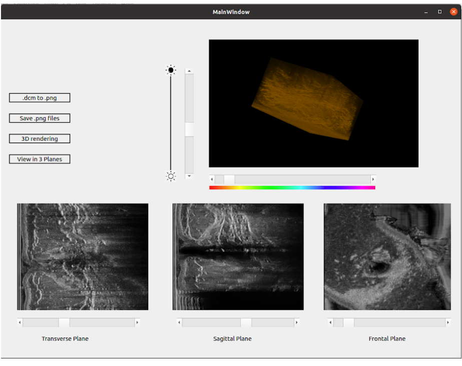

# Breast-Ultrasound-Visualization
The Automated Breast Ultrasound (ABUS) images are rendered in 3D and can be viewed in 3 different planes ( Sagittal Plane, Coronal(Frontal) Plane and Transverse Plane)

### Features ###
* converts multi-frame DICOM file to .png files (As DICOM files can be viewed only with a DICOM viewer, this app converts the DICOM (.dcm) file to separate .png files and lets you view the individual frames saved in a folder)
* renders an interactive 3D model of the DICOM file
* colour and brightness of the rendered object can be changed with the sliders
* frames of the Ultrasound scan be viewed in 3 planes with the help pf sliders

### Application ###
* Aids the radiologists in detecting the lesions
* This Application can also be used for visualizing Ultrasound scans of any part of the body

